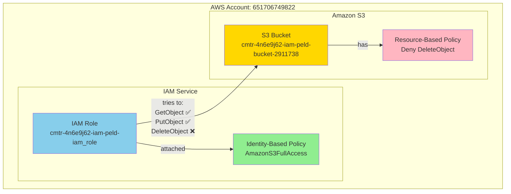
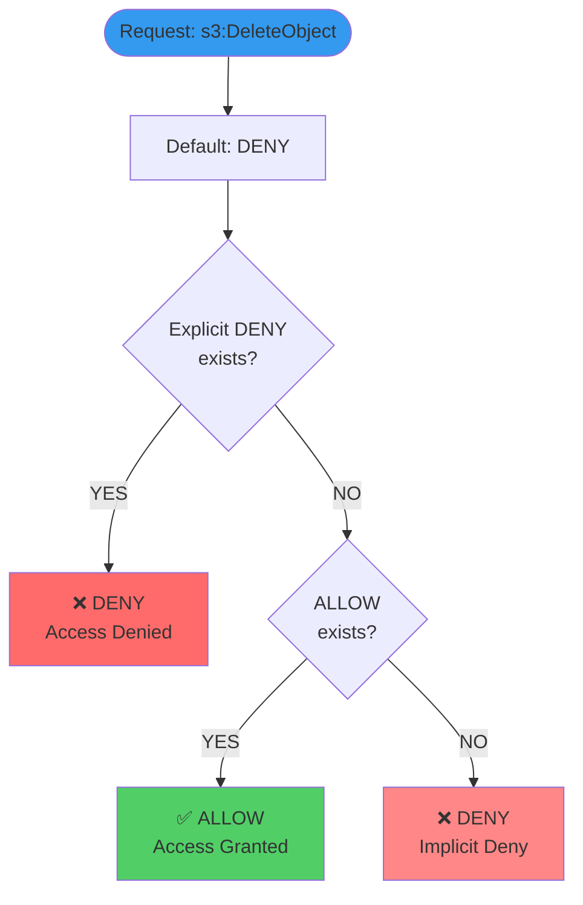
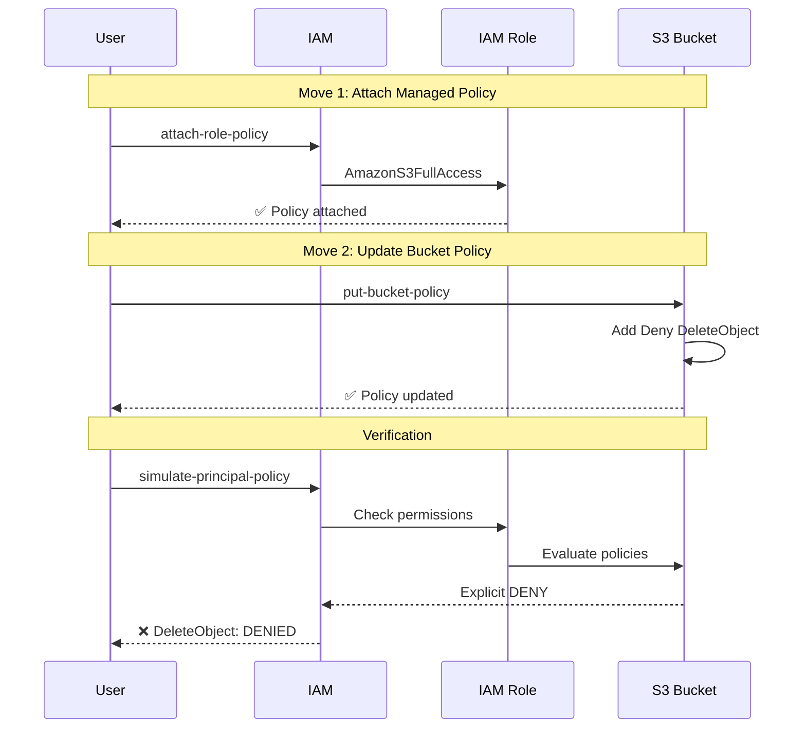
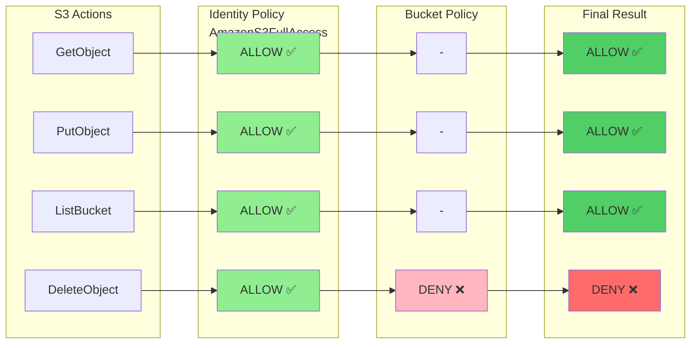
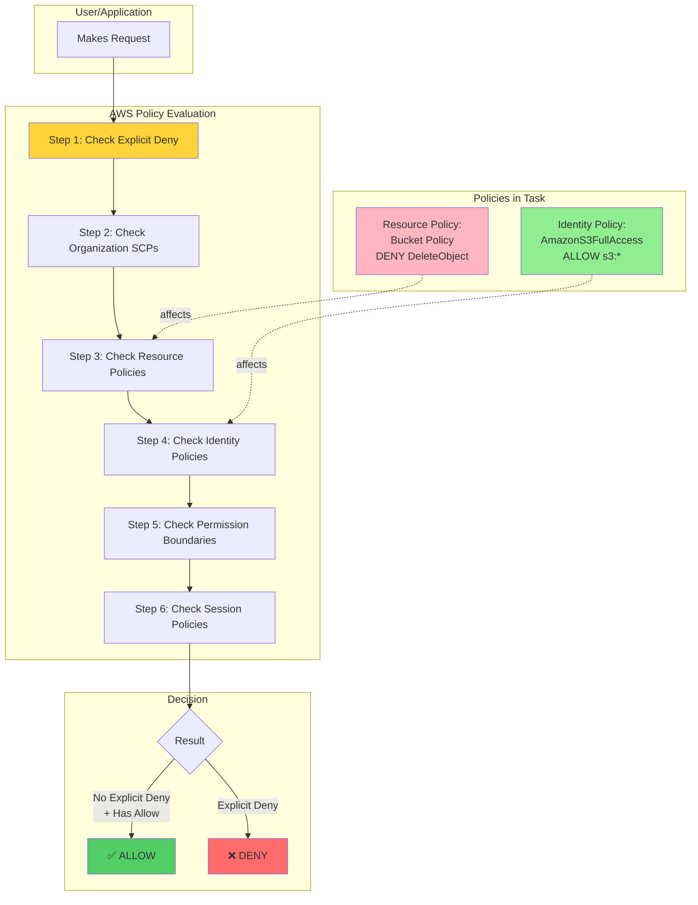
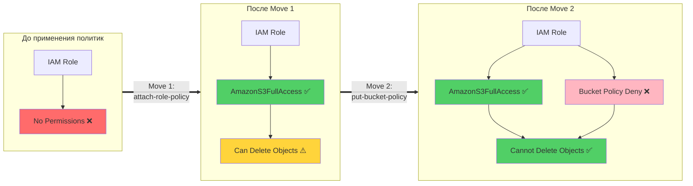

# Визуальные диаграммы (Mermaid)

## 1. Архитектура решения



## 2. Policy Evaluation Flow



## 3. Последовательность выполнения задачи



## 4. Матрица разрешений



## 5. Взаимодействие компонентов



## 6. Сравнение до и после



## Как использовать эти диаграммы

### В GitHub / GitLab
Эти диаграммы Mermaid автоматически рендерятся в README файлах.

### В VS Code
Установите расширение "Markdown Preview Mermaid Support"

### Онлайн
Скопируйте код и вставьте на https://mermaid.live/

### В документации
Большинство современных систем документации (GitBook, Docusaurus, etc.) поддерживают Mermaid.

## Экспорт в изображения

```bash
# Установите Mermaid CLI
npm install -g @mermaid-js/mermaid-cli

# Конвертируйте в PNG
mmdc -i DIAGRAMS.md -o diagram.png

# Или в SVG
mmdc -i DIAGRAMS.md -o diagram.svg
```
